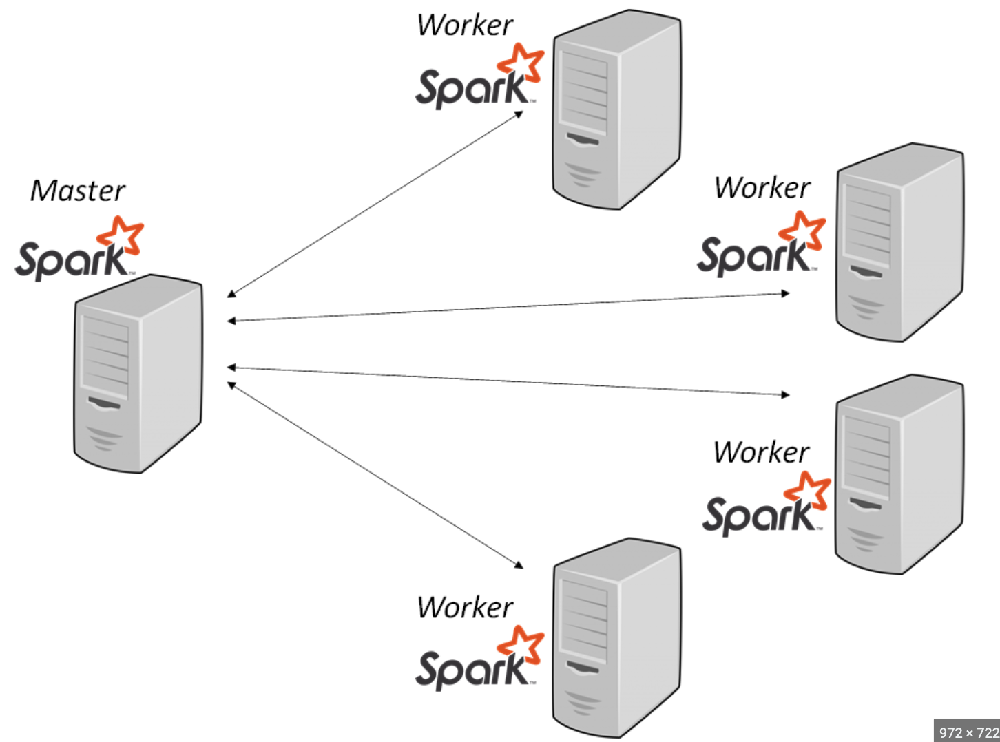

# DataOps: Design e Construção de Cluster Spark Local Para Processamento Distribuído


## Sobre o Projeto

Este repositório tem como objetivo criar um benchmarking para processamento de dados em Cluster Spark Local Distribuído. Conceitos de `DataOps` para times de dados e arquitetura do ambiente Spark serão abordados durante o projeto.

NOTA-SE.: Projeto em Desenvolvimento.


### Abordagens do projeto:

* **Criação do ambiente**: Instalação e configuração do Cluster Spark para processamento distribuído de dados.

### Cluster Spark


## Começando

### Pré-requisitos para rodar o projeto

* **VSCode**: Editor de código. Instruções de instalação você encontra neste [link](https://code.visualstudio.com/download).

* **Docker**: Para subir o Cluster Spark. Instruções de instalação você encontra neste [link](https://www.docker.com/products/docker-desktop/).

### Instalação e Configuração

1. Clone o repositório:

```bash
git clone https://github.com/gustavobi4yourdata/Data-Engineering-Project-08.git
cd Data-Engineering-Project-08
```

2. Inicializar o Cluster Spark:

```bash
docker-compose up -d --scale spark-worker=3
```

3. Visualizar os logs:

```bash
docker-compose logs
```

4. Executar os job Spark:

```bash
docker exec spark-master spark-submit --master spark://spark-master:7077 ./apps/job1.py
```
```bash
docker exec spark-master spark-submit --master spark://spark-master:7077 ./apps/job2.py
```
```bash
docker exec spark-master spark-submit --master spark://spark-master:7077 ./apps/job3.py
```

5. Acessar Spark Master: 
    - http://localhost:9090

6. Acessar History Server:
    - http://localhost:18080

7. Acessar JupyterLab:
    - http://localhost:8888

8. Derrubar o Cluster Spark:

```bash
docker-compose down --volumes --remove-orphans
```
## Links Úteis
- **Apache Spark**: Documentação [link](https://spark.apache.org/)

## Contato

Para dúvidas, sugestões ou feedbacks:

* **Gustavo Souza** - [gustavo.souza@bi4yourdata.com](mailto:gustavo.souza@bi4yourdata.com) 
